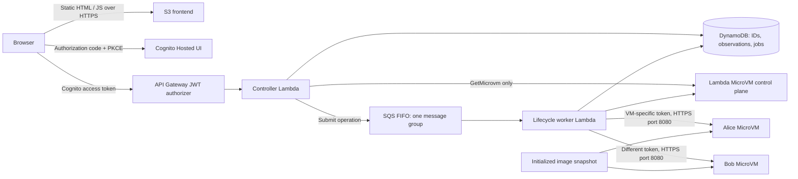

# Architecture

The numbered Terraform directories match the surrounding AWS examples. The frontend uses the same S3 HTTPS endpoint and Cognito Hosted UI pattern as `aws-cognito-app`.

## Infrastructure ownership

* `01-microvms`: private source bucket, build role/logs, initialized MicroVM image. The AWS provider's `aws_cloudcontrolapi_resource` owns the image directly with a JSON property model that preserves required empty arrays; no CloudFormation stack or template is created.
* `02-lambdas`: Cognito, static-asset bucket, HTTP API, API/worker Lambdas, FIFO queue and dead-letter queue, DynamoDB, roles and one-day logs.
* `03-webapp`: frontend files and public deployment configuration uploaded with Terraform S3 objects.

The workstation runs deployment and validation commands. It does not serve the web application or hold a runtime controller open. No Docker installation, EC2 server, NAT gateway, load balancer, or custom domain is required.

## Two different authentication boundaries

Cognito authenticates the presenter. The public SPA client has no secret and uses S256 PKCE, a fresh random state, an exact callback URI and session-scoped access-token storage. API Gateway validates issuer, audience, signature, expiry and the `microvms/control` scope. The controller additionally requires `token_use=access`. Account creation is administrator-only; `create_user.sh` prompts for a password without putting it in shell history or Terraform state.

The static HTML, JavaScript and configuration are publicly readable, as in `aws-cognito-app`. They contain no secrets or session observations. Only the six named static objects are granted anonymous S3 read access. The bucket's regional REST endpoint provides HTTPS. API CORS allows that exact origin.

Separately, the worker requests a MicroVM-specific token restricted to port 8080. Those tokens remain in Lambda memory; they are neither sent to the browser nor written to DynamoDB. The demo tests absent tokens, the other VM's token and access to hook port 8081. Cognito is not installed inside either MicroVM.

This is one presenter's two-slot lab: every administrator-created presenter can control Alice and Bob. It is not a multi-customer application. Job results are additionally restricted to the submitting Cognito subject.

## Asynchronous operations and failure behavior

`POST /api/action` records a request UUID and returns HTTP 202. A single FIFO message group serializes actions across both session slots. The browser polls `GET /api/operations/{id}` until the result is available. The worker has a 240-second timeout, so a 120-second lifecycle wait does not hold an HTTP API integration open.

DynamoDB conditionally changes each job from QUEUED to RUNNING. A duplicate delivery cannot execute the same cell again. A failed or interrupted execution is not automatically replayed: its side effects may already have happened. A lost response therefore requires inspecting the session before submitting a new operation. Queue backlog older than 180 seconds is rejected, pending results expire visibly after 480 seconds, and operation records have a one-day TTL. The dead-letter queue retains messages for one day.

Session metadata is persisted before the first readiness/token/HTTP request after launch. Before another launch the worker inventories the image's sessions, including orphans, and enforces two active slots. This is a demo guard, not an account-wide spending limit. Out-of-band SDK users can bypass it.

Periodic dashboard refresh uses only `GetMicrovm`. It returns the last cached application observation with the current AWS lifecycle state; it never contacts the application endpoint or wakes an idle VM. Explicit Sample, Execute and Wake buttons do send application traffic.

## What survives suspension

The image snapshot contains a loaded 200,000-row dataset and a pre-snapshot image marker. The run hook generates a distinct session nonce after restoration. Each VM holds its own mutable Python namespace, generator cursor, `note.txt`, interpreter and background thread.

DynamoDB holds only IDs, observation copies and operation results. It does not reconstruct the interpreter. The suspend hook logs an event but never pauses the thread. A wall-clock gap with little change in the real thread counter is evidence of AWS freezing execution. A resumed session retains its nonce, generator position and file; terminate followed by launch produces fresh state.

The VM has no AWS execution role. Internet egress is enabled. Python cells can damage their own VM, and the five-second cell limit is a demo usability measure, not a Python security sandbox. Preservation is ephemeral: expiry, failure and termination can lose all session data.

## Deployment and teardown

Apply and validation enter maintenance mode and stop queue polling before changing/testing the image. Teardown rejects new submissions, disables the event source, waits for an in-flight operation, inventories and terminates this image's sessions, then destroys directories in reverse order. Retain Terraform state until teardown succeeds.

## References

* [Cognito PKCE](https://docs.aws.amazon.com/cognito/latest/developerguide/using-pkce-in-authorization-code.html)
* [API Gateway JWT validation and scopes](https://docs.aws.amazon.com/apigateway/latest/developerguide/http-api-jwt-authorizer.html)
* [Lambda SQS delivery and duplicate processing](https://docs.aws.amazon.com/lambda/latest/dg/with-sqs.html)
* [MicroVM lifecycle and authentication](https://docs.aws.amazon.com/lambda/latest/dg/microvms-launching.html)
