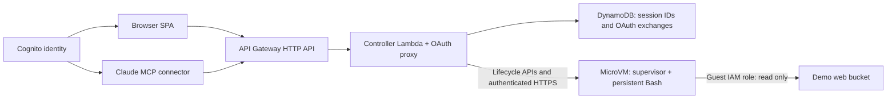

# AWS Lambda MicroVMs - A Shared Sandbox for Browser and Claude

This project demonstrates **AWS Lambda MicroVMs**, the serverless compute
primitive AWS launched in June 2026 that runs isolated Firecracker VMs for up to
eight hours and **preserves live process state across suspend and resume**.

It runs **one MicroVM per user** holding a live Bash shell. The browser and Claude MCP connector use the same Cognito identity to reach the same sandbox. You set some variables and
write a file, then suspend the VM. When it resumes, the shell is exactly where
you left it: no replayed commands, no reconstructed environment, no
deserialization.

Bash also proves the platform contract needs no SDK. The lifecycle hooks are
plain HTTP on a port you declare. Bash uses the Python supervisor to implement
that contract without a language-specific MicroVM client.

**Cells are submitted, not awaited.** That is the second thing this project
demonstrates. `POST /execute` hands a cell to the shell and returns a job id in
milliseconds; the browser polls for the answer. Because the MicroVM already
holds the session's state, it can just as easily hold the job and its result —
so cell execution does not hold a request open and can outlast the deployed
HTTP API integration timeout. Lifecycle requests can still time out. The ceiling on a cell is the MicroVM's own lifetime.


Key capabilities demonstrated:

1. **Stateful Suspend and Resume** – Variables, data structures and open files
   survive an explicit suspend and an HTTPS-triggered resume, with nothing
   serialized, saved or replayed in between.
2. **Long-running cells** - Submit a cell, receive a job ID, and poll for its
   result. Work and results live inside the MicroVM, beyond individual HTTP
   request timeouts. Install Git or the AWS CLI and keep them across suspension.
3. **VM-Level Isolation** – Each session gets its own kernel, filesystem and
   endpoint from a shared image snapshot.
4. **Snapshot-Safe Identity** – A session nonce is generated in the `/run`
   lifecycle hook, demonstrating why identity must not be baked into a snapshot.
5. **Infrastructure as Code (IaC)** – Terraform provisions the Bash image, Cognito,
   API Gateway, Lambda, DynamoDB and S3 web hosting.



## MicroVM Concepts, in EC2 Terms

The application's main panel is a configuration table that reports how each
MicroVM was actually launched, alongside the EC2 concept it corresponds to.
Several rows have **no EC2 equivalent at all**:

| Concept | MicroVMs | EC2 |
|---|---|---|
| Build recipe | Dockerfile, built remotely by AWS | Packer template / EC2 Image Builder |
| Image | MicroVM image (memory **and** disk) | AMI (disk only) |
| Base image | `al2023-1`, exactly one, versioned | *no equivalent — you don't pick the host OS* |
| Sizing | Baseline memory, vCPU derived, bursts 4x | Instance type from a catalog |
| Boot payload | `runHookPayload` (16 KB) | User data (16 KB) |
| Init | `/run` lifecycle hook | cloud-init |
| Inbound | Network connectors | Security group rules |
| Credentials | Guest execution role: read access to the demo web bucket | IAM instance profile |
| Access | Per-VM HTTPS endpoint + scoped token | Public IP + SSH keypair |
| Idle behaviour | Auto-suspend, auto-resume on traffic | *no equivalent* |
| Lifetime | Hard ceiling, 8 hours maximum | *no equivalent — instances run forever* |

Run `./probe-microvm-images.sh` to see the base image catalog: **one image,
a handful of versions**, against `describe-images` returning tens of thousands
of AMIs.

## Build Process

| Phase | Directory | What it creates |
|-------|-----------|-----------------|
| 1 | `01-microvms` | Private source bucket, build role, **one** MicroVM image |
| 2 | `02-lambdas` | HTTP API, controller Lambda, DynamoDB, web bucket |
| 3 | `03-webapp` | Static SPA and the generated `config.json` |

`01-microvms/bash/` holds a Dockerfile and a server implementing the hook
contract. Everything is still derived from a `runtimes` map, so adding a second
runtime requires the map entry, source directory, packaging, presets and validation cells — but each image
carries a one-week minimum storage charge, so the default builds only what the
demo uses.

The image runs a Python HTTP supervisor, because bash has no usable HTTP server.
The **session runtime** — the process holding state across a checkpoint — is
bash.

## API Endpoints

Routes on a single **API Gateway HTTP API**, serving both front doors: `/api/*`
for the SPA, `POST /mcp` for the Claude connector, and `/oauth/*` for the
authorization-server proxy. There is no gateway authorizer — the Lambda resolves
the Cognito access token itself, because the caller's **email is the session
key** and this implementation resolves the token through Cognito userInfo to obtain the email. Gateway authorizers are not inherently limited to a yes/no result.

### GET /api/config

Returns the runtime list, each runtime's code presets, and each runtime's
configuration spec — the data behind the comparison table.

### GET /api/status

Current lifecycle state of each launched session. Calls **`GetMicrovm` only**:
sending traffic to a MicroVM endpoint would auto-resume a suspended VM and
destroy the behavior the demo exists to show.

### POST /api/action

Lifecycle operations run synchronously. `execute` submits a cell and returns `result.job`; poll with `action: "result"` and that `job` ID. The current/latest job and result live in supervisor memory, not a durable queue. Only one cell runs at a time; additional submissions are refused.

```json
{ "runtime": "bash", "action": "execute", "code": "visits=$((visits + 1))" }
```

| Field | Type | Required | Description |
|-------|------|----------|-------------|
| `runtime` | string | Yes | `bash`. |
| `action` | string | Yes | `launch`, `suspend`, `wake`, `execute`, `result`, `reset`, `terminate`. |
| `code` | string | No | Source for `execute`: controller maximum 16,000 bytes; guest maximum 12,000 characters. Both apply. |
| `job` | string | For `result` | Job ID returned by `execute`. |

## Deploy the Build

```bash
./apply.sh
```

Resolves the newest managed base image version, packages the runtime zip plus
the controller, applies each phase, and finishes by running `validate.sh` —
which prints the application URL, the MCP connector URL and how to create a user.

## Sign In

Authentication is **Amazon Cognito**, and it is the same identity for both front
doors. The browser signs in with the hosted UI using PKCE; Claude signs in
through the OAuth proxy. Both resolve to one email, and the controller keys the
MicroVM session on it — so **your browser and Claude drive the same sandbox**.
Install a package from the web app, then ask Claude what is installed.

Sign-up is self-service: choose **Sign up** in the hosted UI and Cognito
verifies the address by email. Note what that implies — each new user can launch
their own billable MicroVM. The bounds are the idle policy, the maximum lifetime
and reserved concurrency, not the user list. To close it instead, set
`allow_admin_create_user_only = true` in `cognito.tf` and create users with
`aws cognito-idp admin-create-user`.

`config.json` carries the API URL, the hosted-UI domain and the SPA's client id.
All three are public by design — a public OAuth client is exactly what PKCE
exists to make safe.

### Connecting Claude

Add the printed `MCP` URL as a custom connector. Claude discovers the
authorization server, registers itself, opens the Cognito hosted UI for you to
sign in, and then calls the tools: `launch_session`, `run_cell`, `get_result`,
`get_file`, `share_file`, `session_status`, `suspend_session`, `reset_session`,
`terminate_session`.

**Getting files back.** A cell's stdout is capped at 64 KB and truncated, so
returning an image by base64-ing it into cell output does not work — the model
will try to chunk it and fail slowly. `get_file` exists instead: the MicroVM
serves the bytes on its own `/file` endpoint, and the controller returns them
as MCP content, so an image renders directly in the conversation. Ask for a
plot and you see the plot.

Files over 750 KB, and anything with nothing to render, fall back to
`share_file` behaviour: the controller stages the object in a private bucket
and returns a presigned URL that expires in an hour. The **MicroVM never
touches S3** — the controller already holds credentials, so routing the upload
through it leaves the guest's execution role as small as it is.

> **This is a demo, not a product.** A session's execution role is the ceiling on
> what any submitted cell can do, and cells run through `eval`. Per-user identity
> makes widening that role defensible — it does not make it automatic. Run
> `./destroy.sh` when you finish.

In the browser, click **Launch**. With one runtime, the tab selector is hidden. Then run the same cell,
**Check state**, at four points — it never changes, and the answer does:

| Step | Output | Why |
|---|---|---|
| Launch, then **Check state** | `user = default`, `visits = 0`, `items = alpha beta`, `file = (none)` | These were set during the **image build** and live in the snapshot. No cell created them. |
| **Update state**, then check | `user = mike`, `visits = 1`, `items = alpha beta item1` | Ordinary mutation of state that was already there. |
| **Suspend**, **Wake via HTTPS**, then check | unchanged | Nothing was saved or reloaded, so it is the same process. |
| **Terminate**, **Launch**, then check | back to `default` / `0` / `alpha beta` | A new VM is a fresh clone of the image. Session memory is gone; image memory is not. |

That last row is the point: **image memory** is baked in at build and identical
in every VM, while **session memory** belongs to one MicroVM and dies with it.
Run `Update state` repeatedly and `visits` keeps climbing — until you terminate.

## Validate the Build

```bash
./validate.sh
```

Launches a MicroVM, seeds live shell state, suspends it, resumes it with an
ordinary HTTPS request, and asserts the output is exactly `42 1 validated`.
It also confirms the MicroVM endpoint rejects unauthenticated requests with
403 and the controller rejects a request with no access token with 401. Sessions are
terminated on exit, including on failure.

This script does not validate the authenticated browser/Claude hand-off, OAuth,
package installation, or the complete initial/update/resume/reset sequence.
Rehearse those manually; the presence of validation code is not evidence of a
successful live run.

## Enumerate the Available Images

```bash
./probe-microvm-images.sh
```

Read-only. Lists the AWS-managed base images with every published version, then
the images this account has built. Safe to run before `apply.sh`.

## Destroy the Build

```bash
./destroy.sh
```

MicroVMs are not owned by Terraform, so teardown terminates every session from
**every image recorded in local Terraform outputs** first, including orphaned sessions for those images, then destroys the three phases in
reverse order. Keep the local Terraform state until it succeeds.

## Cost Controls

Each MicroVM uses the **0.5 GB / 0.25 vCPU baseline** (bursting to 2 GB / 1 vCPU),
auto-suspends after 30 minutes idle, terminates after 30 minutes suspended, and
has an **8-hour maximum lifetime** — the service ceiling. Idle suspension and the lifetime limit both bound resource use. An idle VM stops costing compute after 30
minutes and is gone 30 minutes later, so the full 8 hours is only reached by a
session someone is still using. The application intends one session per user/runtime; lookup and creation are
not an atomic quota mechanism. Request throttling and reserved Lambda concurrency
limit throughput, not the total number of live MicroVMs or total spending.

At ARM rates that baseline costs **$0.0315/hour** while RUNNING
(0.25 vCPU x $0.0000276944 + 0.5 GB x $0.0000036667 per second) and **nothing**
while SUSPENDED. There is no per-request charge.

Suspending is not free, though: **$0.0038/GB** to write the snapshot and
**$0.00155/GB** to read it back on resume — and a snapshot read is also charged
on every launch. That round trip only pays for itself after roughly **ten idle
minutes per GB of snapshot**, which is why auto-suspend is set to 30 minutes
rather than something aggressive. Use the **Suspend** button to see it on
demand; the idle policy is a cost guard, not the demonstration.

This is also why `GET /api/status` calls `GetMicrovm` and never touches the VM:
polling the endpoint would auto-resume a suspended MicroVM and bill a snapshot
read on every refresh.

Images are billed separately from MicroVMs at **$0.08/GB-month with a one-week
minimum**, whether or not anything is running. Image names are content-hashed,
so every source change mints a new image that bills for at least a week —
which is the main reason this builds one image rather than three —
`destroy.sh` deletes them but cannot undo the minimum. Log groups use one-day
retention. See [Lambda pricing](https://aws.amazon.com/lambda/pricing/).

## Notes and Limits

Submitted code runs inside the MicroVM, and the **VM** — not the interpreter — is
the security boundary. The guest receives temporary credentials for a shared execution role granting
`s3:ListBucket` and `s3:GetObject` on the demo web bucket. Per-user session
identity does not create per-user IAM policies. Internet egress is enabled.
The supervisor cell timeout is eight hours, bounded by the remaining VM lifetime
and lifecycle policy. Submitted code can use the role permissions.

Session preservation is ephemeral and is not durable storage. Termination,
expiry or failure loses all session state.

Lambda MicroVMs are available in N. Virginia, Ohio, Oregon, Ireland and Tokyo;
`01-microvms/variables.tf` enforces that list.


## Browser and Claude rehearsal

1. Sign in to the browser and MCP connector with the same Cognito account.
2. Launch in the browser. Run **Check state**, then **Update state**.
3. Ask Claude to reuse the session, run `echo "$user $visits ${items[*]}"`, and
   collect the result with `get_result`. It should see the browser's values.
4. Install Git or the AWS CLI in either interface, then inspect the installation
   from the other. The CLI preset calls STS and reads the demo web bucket.
5. Suspend, confirm SUSPENDED using status, then wake through HTTPS or run a cell.
   Verify memory, files and installed tools remain.
6. Reset or terminate and launch again. Session changes disappear; image defaults return.

## Request and state boundaries

The public routes are OAuth discovery, registration and authorization/token
exchange. `/api/*` and `POST /mcp` resolve the caller's access token in Lambda.
The SPA uses PKCE; Claude uses the OAuth proxy and its separate Cognito client.
Session keys combine the normalized email and runtime. DynamoDB holds identifiers
and cached observations; a separate table holds temporary OAuth exchange records.
Bash state and the current job/result remain inside the guest.

Status requests use only `GetMicrovm`. Result polling contacts the application
endpoint and can wake a suspended VM. Lifecycle calls remain synchronous and can
still time out: the gateway integration is 29 seconds and the controller is 30.
There is no SQS queue, worker Lambda or Function URL in the current deployment.

Cells share one shell. Do not use `set -e` in its top-level context: a failed
command can exit the shell. Use `( set -e; ... )` for a fail-fast subshell.
Commands cannot prompt; stdin is closed. The guest's `dnf` is microdnf and does
not support every full-dnf option. A dead worker requires reset or termination.

## Development host and incremental deployment

Use Linux with AWS CLI v2 supporting `lambda-microvms`, Terraform, Bash, Python 3
with pip, zip, jq and curl. The normal AWS credential chain applies; no named
`default` profile is required. Root scripts currently select `us-east-1`.
Deployment packages the controller for Python 3.14 ARM64 and vendors boto3.
No local Docker daemon or web server is required.

Keep Terraform state and generated `deployment.tfvars.json` files for teardown.
For an existing deployment, print URLs without starting validation:

```bash
terraform -chdir=02-lambdas output -raw web_url
terraform -chdir=02-lambdas output -raw mcp_url
```

Apply backend Terraform edits using the existing generated inputs:

```bash
terraform -chdir=02-lambdas init
terraform -chdir=02-lambdas apply -var-file=deployment.tfvars.json
```

Controller source edits also require rebuilding `dist/controller.zip`;
`apply.sh` performs packaging. Avoid using either client during teardown.
Historical images absent from local state are outside destroy.sh's inventory.
