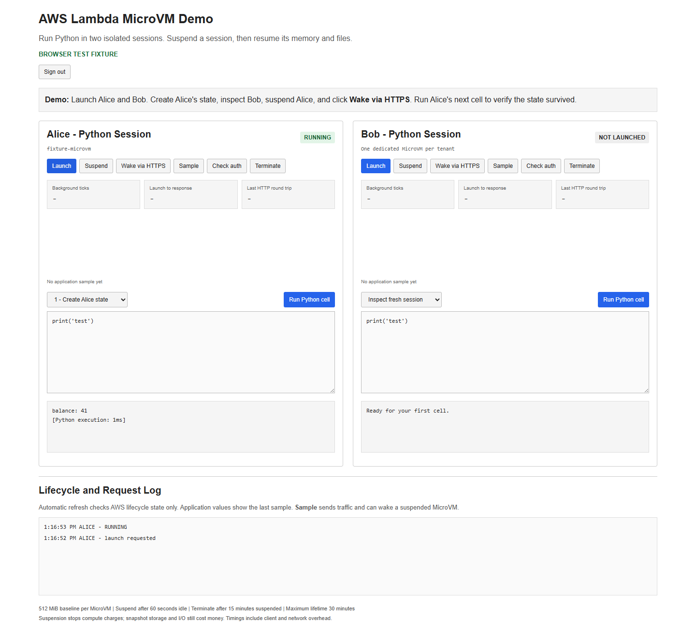
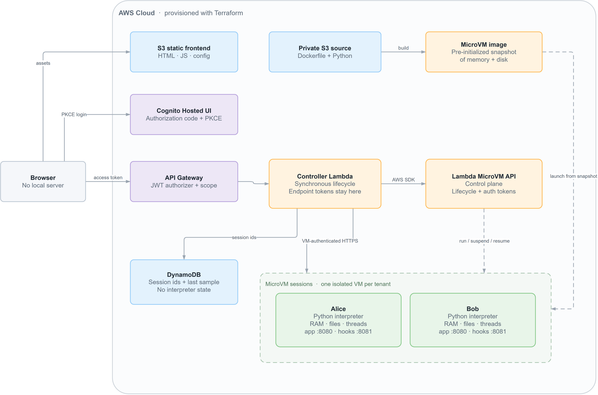

# AWS Lambda MicroVMs — Python, Node.js and Bash, Same Platform

This project demonstrates **AWS Lambda MicroVMs**, the serverless compute
primitive AWS launched in June 2026 that runs isolated Firecracker VMs for up to
eight hours and **preserves live process state across suspend and resume**.

It runs **three MicroVMs from three images** — Python, Node.js and Bash. You
create a variable, advance a generator and write a file, then suspend the VM.
When it resumes, the interpreter is exactly where you left it: no replayed code,
no reconstructed namespace, no deserialization.

The three runtimes are configured identically. Every launch parameter,
connector, policy and limit is the same; only the image differs. That is the
point.

Bash earns its place by demonstrating two things the other two cannot. A
**background job survives the checkpoint** — start `sleep 3000 &`, suspend the
VM, wake it, and the same PID is still counting. And because bash needs roughly
four seconds to build the same dataset Python and Node build in milliseconds,
it is the only runtime where the snapshot's saving is **visible on a clock**.



Key capabilities demonstrated:

1. **Stateful Suspend and Resume** – Memory, generator position, open files and
   background threads survive an explicit suspend and an HTTPS-triggered resume.
2. **Runtime Independence** – The same platform configuration runs a Python
   interpreter, a Node.js interpreter and a Bash shell, and `validate.sh`
   asserts all three against byte-identical expected output.
3. **VM-Level Isolation** – Each session gets its own kernel, filesystem and
   endpoint from a shared image snapshot.
4. **Snapshot-Safe Identity** – A session nonce is generated in the `/run`
   lifecycle hook, demonstrating why identity must not be baked into a snapshot.
5. **Infrastructure as Code (IaC)** – Terraform provisions both MicroVM images,
   API Gateway, Lambda, DynamoDB and S3 web hosting.



## MicroVM Concepts, in EC2 Terms

The application's main panel is a configuration table that reports how each
MicroVM was actually launched, alongside the EC2 concept it corresponds to.
Several rows have **no EC2 equivalent at all**:

| Concept | MicroVMs | EC2 |
|---|---|---|
| Image | MicroVM image (memory **and** disk) | AMI (disk only) |
| Base image | `al2023-1`, exactly one, versioned | *no equivalent — you don't pick the host OS* |
| Sizing | Baseline memory, vCPU derived, bursts 4x | Instance type from a catalog |
| Boot payload | `runHookPayload` (16 KB) | User data (16 KB) |
| Init | `/run` lifecycle hook | cloud-init |
| Background work | Child processes survive a checkpoint | *no equivalent — a stop loses the process* |
| Inbound | Network connectors | Security group rules |
| Credentials | Execution role (none here) | IAM instance profile |
| Access | Per-VM HTTPS endpoint + scoped token | Public IP + SSH keypair |
| Idle behaviour | Auto-suspend, auto-resume on traffic | *no equivalent* |
| Lifetime | Hard ceiling, 8 hours maximum | *no equivalent — instances run forever* |

Run `./probe-microvm-images.sh` to see the base image catalog: **one image,
a handful of versions**, against `describe-images` returning tens of thousands
of AMIs.

## Build Process

| Phase | Directory | What it creates |
|-------|-----------|-----------------|
| 1 | `01-microvms` | Private source bucket, build role, **three** MicroVM images |
| 2 | `02-lambdas` | API Gateway, controller Lambda, DynamoDB, web bucket |
| 3 | `03-webapp` | Static SPA and the generated `config.json` |

`01-microvms/python/`, `01-microvms/node/` and `01-microvms/bash/` each hold a
Dockerfile and a server implementing the same HTTP contract. Adding a fourth
runtime means adding one line to `01-microvms/locals.tf` and a directory —
nothing else needs to know.

The bash image runs a Python HTTP supervisor, because bash has no usable HTTP
server; the **session runtime** — the process holding state across a checkpoint
— is bash. Its `server.py` is a deliberate copy of the Python one, differing
only in which worker it launches, since each runtime directory is zipped
independently and cannot import from a sibling.

## API Endpoints

Three routes on an **API Gateway HTTP API**. Every request must carry the demo
passphrase in an `X-Demo-Passphrase` header.

### GET /api/config

Returns the runtime list, each runtime's code presets, and each runtime's
configuration spec — the data behind the comparison table.

### GET /api/status

Current lifecycle state of each launched session. Calls **`GetMicrovm` only**:
sending traffic to a MicroVM endpoint would auto-resume a suspended VM and
destroy the behavior the demo exists to show.

### POST /api/action

Runs one lifecycle operation synchronously.

```json
{ "runtime": "node", "action": "execute", "code": "balance += 1;" }
```

| Field | Type | Required | Description |
|-------|------|----------|-------------|
| `runtime` | string | Yes | `python`, `node` or `bash`. |
| `action` | string | Yes | `launch`, `suspend`, `wake`, `sample`, `execute`, `terminate`. |
| `code` | string | No | Source for `execute`. Max 16 KB. |

## Deploy the Build

```bash
./apply.sh
```

Resolves the newest managed base image version, packages all three runtime zips
plus the controller, applies each phase, and finishes by running `validate.sh` —
which prints the application URL **and the demo passphrase**.

## Sign In

There are no user accounts. The application is gated by a single shared
passphrase, generated by Terraform and printed at the end of `validate.sh`:

```
  App        : https://…s3.us-east-1.amazonaws.com/index.html
  API        : https://….execute-api.us-east-1.amazonaws.com
  Passphrase : cheerful-mallard-summit
```

Open the app, type the passphrase, and you are in. It is stored in
`sessionStorage`, so it dies with the browser tab.

The passphrase is deliberately **not** written into `config.json` — that file is
world-readable from the S3 bucket, so anything shipped in it would be public.

> **This is a demo, not a product.** There is no Cognito, no user pool and no
> per-user isolation, because five moving parts of authentication taught nothing
> about MicroVMs. The passphrase plus API Gateway throttling is all that stands
> between a stranger and an endpoint that executes code and launches billable
> VMs. Run `./destroy.sh` when you are finished.

In the browser: pick a tab, **Launch**, run **Seed state**, **Suspend**, then
**Wake via HTTPS** and run **Continue state**. Expect balance **42**, generator
value **1**, and the file intact. Do it in the other tabs and watch the
identical sequence in a different language.

On the Bash tab, **Background job** is worth a second pass: run it, suspend,
wake, and run it again to see the same child process still alive.

## Validate the Build

```bash
./validate.sh
```

For **each** runtime: launches a MicroVM, seeds interpreter state, suspends it,
resumes it with an ordinary HTTPS request, and asserts the output is exactly
`42 1 validated` — the same string for all three languages. It also confirms the
MicroVM endpoint rejects unauthenticated requests with 403 and the controller
rejects a missing passphrase with 401. Sessions are terminated on exit,
including on failure.

## Enumerate the Available Images

```bash
./probe-microvm-images.sh
```

Read-only. Lists the AWS-managed base images with every published version, then
the images this account has built. Safe to run before `apply.sh`.

## Destroy the Build

```bash
./destroy.sh
```

MicroVMs are not owned by Terraform, so teardown terminates every session from
**every** image first — including orphans — then destroys the three phases in
reverse order. Keep the local Terraform state until it succeeds.

## Cost Controls

Each MicroVM uses the **0.5 GB / 0.25 vCPU baseline** (bursting to 2 GB / 1 vCPU),
suspends after 60 seconds idle, terminates after 15 minutes suspended, and has a
30-minute maximum lifetime. One session per runtime, so at most three VMs.

Three images means three image-storage charges. Suspended MicroVMs stop compute
charges but still incur snapshot storage. Log groups use one-day retention. See
[Lambda pricing](https://aws.amazon.com/lambda/pricing/).

## Notes and Limits

Submitted code runs inside the MicroVM, and the **VM** — not the interpreter — is
the security boundary. Neither MicroVM receives an execution role, so neither
holds AWS credentials; internet egress is enabled. The five-second cell timeout
is a usability guard, not a sandbox.

Session preservation is ephemeral and is not durable storage. Termination,
expiry or failure loses all session state.

Lambda MicroVMs are available in N. Virginia, Ohio, Oregon, Ireland and Tokyo;
`01-microvms/variables.tf` enforces that list.
