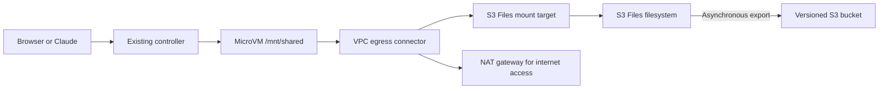

# S3 Files from the MicroVM

This uses the same Amazon S3 Files resources as `aws-s3-files`, without Active
Directory, Samba, Windows, or an EC2 gateway. One MicroVM writes a file through
NFS; you verify the exported object in the backing S3 bucket.



## Deploy on Linux

Use your normal AWS credential chain: environment variables, an instance role,
or your existing CLI configuration. No named profile is forced.

```bash
git pull --ff-only
python3 -m unittest discover -s tests -v
./apply.sh
```

The image must be rebuilt: it now includes `amazon-efs-utils`, `nfs-utils`,
`util-linux`, and `/app/storage.sh`, and allows elevated Linux capabilities.
`apply.sh` still runs the existing three Terraform phases. Phase 2 also creates
the filesystem and networking. AWS provider 6.40 or newer is required.

The network connector is Terraform-managed through Cloud Control, the same
mechanism used for the MicroVM image. There is no CloudFormation stack.

`validate.sh`, called by apply, launches its own short-lived VM and checks:

1. Mounting succeeds and `/mnt/shared` is an NFS mount, not just a directory.
2. A file can be written through that mount.
3. Interpreter state survives explicit suspension and request-triggered resume.
4. The existing mounted file can be read and a second file written after resume.
5. Both files appear in S3 with exactly the expected contents.

It waits up to five minutes per object for export, terminates its VM on exit,
and retains the test objects for inspection. `test-results/shared-file.txt`
contains the last object retrieved independently using the deployment credentials.

The guest and controller are not granted `s3:PutObject` on this backing bucket.
The S3 Files service role performs exports. This keeps the demonstration's data
path unambiguous: the write is through NFS, not an SDK upload.

## Recording sequence

1. Open the application URL printed by apply/validate. Terminate any old browser
   session and launch a fresh one: existing VMs do not acquire the new image or
   VPC connector automatically.
2. Select **Check S3 Files Mount**, then **Run cell**. The output identifies the NFS
   mount. The mount starts automatically after launch. This preset only checks it, lists the directory, and runs `df -H`.
3. Select **Write shared file**, then **Run cell**. This writes
   `Hello World` directly to `/mnt/shared/hello.txt` and lists the file.
   A mount check prevents an accidental local-disk write. No storage wrapper
   is called by the write or read preset.
4. Open the bucket link printed by validation. Refresh until
   `hello.txt` appears, then download/open it. Its contents are `Hello World`.
5. Suspend the VM, wait for SUSPENDED, then run **Read shared file**. Run
   **Write shared file** again to demonstrate post-resume writes as well.

Retrieve the URLs at any time:

```bash
terraform -chdir=02-lambdas output -raw web_url
terraform -chdir=02-lambdas output -raw storage_console_url
```

Independent CLI verification (no upload):

```bash
bucket=$(terraform -chdir=02-lambdas output -json storage | jq -r .bucket)
aws s3 ls "s3://${bucket}/"
aws s3 cp "s3://${bucket}/hello.txt" -
```

S3 Files batches exports for approximately 60 seconds; synchronization can take
longer. `sync` flushes the NFS write but does not force immediate export to S3.
Do not delete the filesystem while waiting for an object you want to retain.

## Mount implementation

The controller passes the filesystem ID, mount-target IP, and region through
`runHookPayload`. The `/run` hook writes this non-secret configuration after
image restore. No active NFS mount or guest credentials are baked into the image.

The `/run` hook starts a background mount and returns immediately. Storage
reports connecting, ready, or error through `/state`. The `/resume` hook starts
a bounded check of the existing mount, not another mount. Dashboard status is
last-observed data: regular refresh does not wake suspended VMs. Run Check S3
Files Mount to sample it again. A mount error leaves the shell usable; inspect
the mount log, correct the cause, and launch a fresh session to retry.

`storage.sh` uses `mount.s3files` with TLS and IAM authentication. An explicit
mount-target IP avoids depending on EC2 availability-zone discovery. The
`nodirects3read` option keeps reads on the NFS path for this demonstration.
The guest role has filesystem-scoped ClientMount, ClientWrite, and ClientRootAccess
permissions; the latter allows creation of the demo directory at the share root.

The helper's watchdog is started explicitly because the guest runs the Python
supervisor rather than systemd. The utility must obtain renewable credentials
from the guest execution role. This and post-resume connectivity require the
live AWS validation; local mocked tests do not establish service compatibility.

Every authenticated demo user has access to the same filesystem through the
shared guest role. This is a storage connectivity lab, not per-user storage
isolation. Use only demonstration data.

## Cost and teardown

One AZ, one mount target, one NAT gateway. NAT preserves package installs and
other internet-dependent demo commands after switching to VPC egress. The S3
gateway endpoint routes S3 traffic without NAT. The controller Lambda itself
does not need to run inside the VPC.

Budget for NAT gateway hours/data processing, its public IPv4 address, S3 Files
storage/operations, S3 requests/versioned objects, and MicroVM charges. NAT
continues billing while MicroVMs are suspended. Tear the lab down after testing:

```bash
./destroy.sh
```

The script terminates MicroVMs before Terraform removes the connector and
filesystem. The dedicated demo bucket uses `force_destroy`; teardown deletes
its objects and versions too. Teardown removes mount targets and force-deletes
the filesystem through the AWS CLI because the Terraform provider does not
expose `forceDelete`. Pending exports are discarded. Terraform then refreshes
its state and finishes resource cleanup. Download anything you want to keep first.

## Troubleshooting

- **Mount helper absent:** confirm a newly built image/session is in use.
- **Permission denied / operation not permitted:** check image capabilities,
  execution-role filesystem permissions, and the S3 Files filesystem policy.
- **Mount timeout:** check connector ACTIVE state, NFS TCP 2049 from the
  connector security group, target availability, routing, and mount-target IP.
- **Credential error:** inspect `/var/log/amazon/efs/mount.log` inside the VM.
  Do not paste access keys or session tokens into a preset or log output.
- **File visible over NFS but not in S3:** allow export time, then inspect S3
  Files PendingExports/ExportFailures and the service role's bucket/EventBridge
  permissions. An NFS write alone is not a passed end-to-end test.
- **Reads hang after resume:** the validation reports failure; inspect the mount
  and watchdog before remounting. Do not hide reconnection failures as success.

## References

- [S3 Files mount helper](https://github.com/aws/efs-utils)
- [S3 Files synchronization](https://docs.aws.amazon.com/AmazonS3/latest/userguide/s3-files-performance.html)
- [MicroVM VPC connectors](https://docs.aws.amazon.com/lambda/latest/dg/microvms-networking.html)
- [MicroVM elevated OS capabilities](https://docs.aws.amazon.com/lambda/latest/dg/microvms-images.html)
